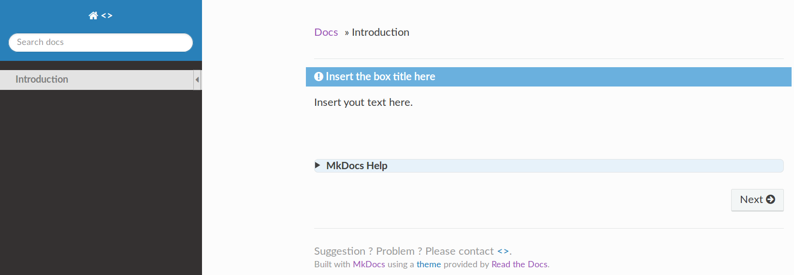
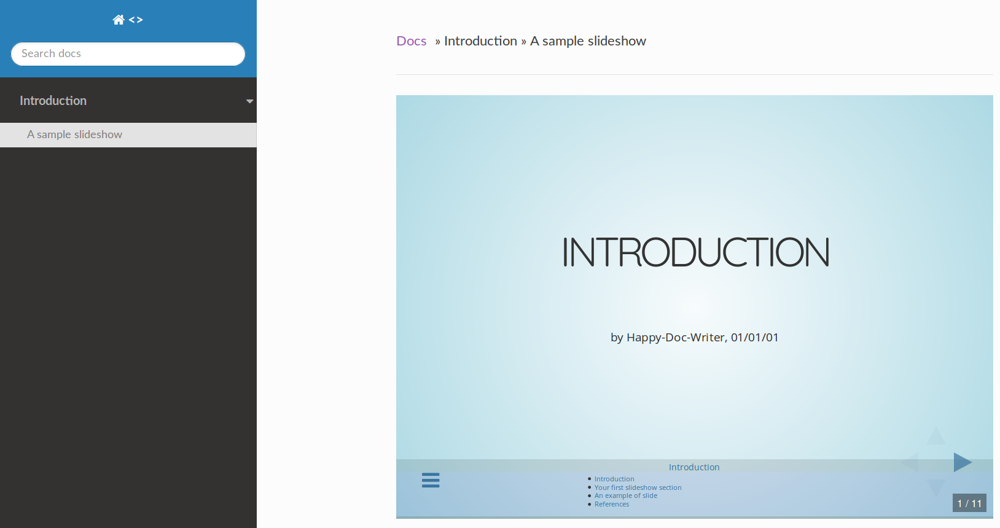

# Tuning MkDocs Web pages

The following tutorial is aimed to complement the documentation available on [mkdocs.org](http://mkdocs.org). It is strongly advised to also rely on this documentation in addition of what is presented hereafter.

Each subsection gives an example of code and its rendering.

## Section with subsections

`/mkdocs.yml`:

```gedit
# Reference: http://mkdocs.org
site_name: [...]
site_author: [...]
pages:
  - 'Introduction': index.md
  - 'Introduction':
    - 'A sample slideshow': slides/intro.md
extra:
  mailto: [...]
[...]
```

When clicking on "*Introduction*":



When collapsing the section with the caret and clicking on "*A sample slideshow*":




## Using boxes

### Warning box

```
!!! warning "Summary"
```

Will be rendered as:


### Note box

```
!!! note "Example"
```

Will be rendered as:


### Important box

```
!!! important "Exercises | Solutions | Demonstration"
```

Will be rendered as:


### Danger box

```
!!! danger "Important note"
```

Will be rendered as:


### Reminder box

```
!!! reminder "Additional information"
```

Will be rendered as:


