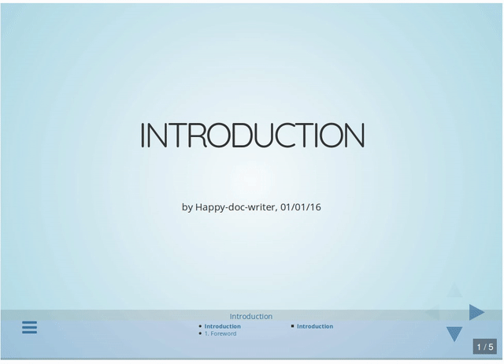
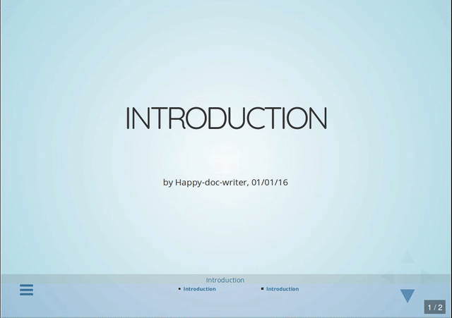
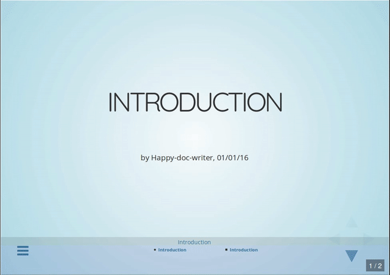
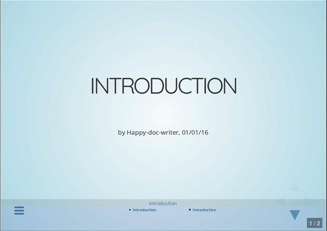

# Tuning Reveal.js slideshows

The following tutorial is aimed to complement the documentation of [Reveal.js](http://lab.hakim.se/reveal-js/). It is strongly advised to also rely on this documentation in addition of what is presented hereafter.

Each subsection gives an example of code and its rendering.

## Organizing sections

* `-----` defines a new section (browsable **horizontally**)
* `----` defines a new slide in the current section (browsable **vertically**)

```markdown
## <!-- .element: class="slideshow-title" --> Introduction

<small>by Happy-doc-writer, 01/01/16</small>

----

[...]

-----

## 1. Foreword

----

### First slide of foreword

[...]

----

### Second slide of foreword

[...]

```

This will be rendered as:




## Adding a flowchart

```markdown
## <!-- .element: class="slideshow-title" --> Introduction

<small>by Happy-doc-writer, 01/01/16</small>

----

--flowchart--

```

This will be rendered as:




## Adding a mindmap

```markdown
## <!-- .element: class="slideshow-title" --> Introduction

<small>by Happy-doc-writer, 01/01/16</small>

----

--mindmap--

```

This will be rendered as:




## Adding a quizz

```markdown
## <!-- .element: class="slideshow-title" --> Introduction

<small>by Happy-doc-writer, 01/01/16</small>

----

---quizz---

```

This will be rendered as:



